# Smishing Botnets
In the last few months, multiple Iranian media and social networks have published warnings about ongoing SMS phishing campaigns impersonating Iranian government services. The story is as old as time: victims click on a malicious link, enter their credit card details, and in a matter of hours their money is gone.

* Infection Chain
 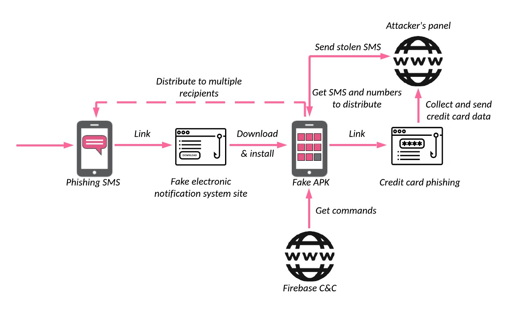

* Examples of phishing SMS sent to the Iranian citizens
 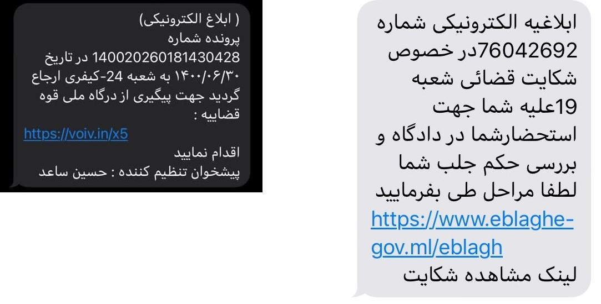

* The phishing site notifies the victim about the complaint against them (on the left) and asks for personal information like name, phone number, and national code to proceed to a fake electronic system
 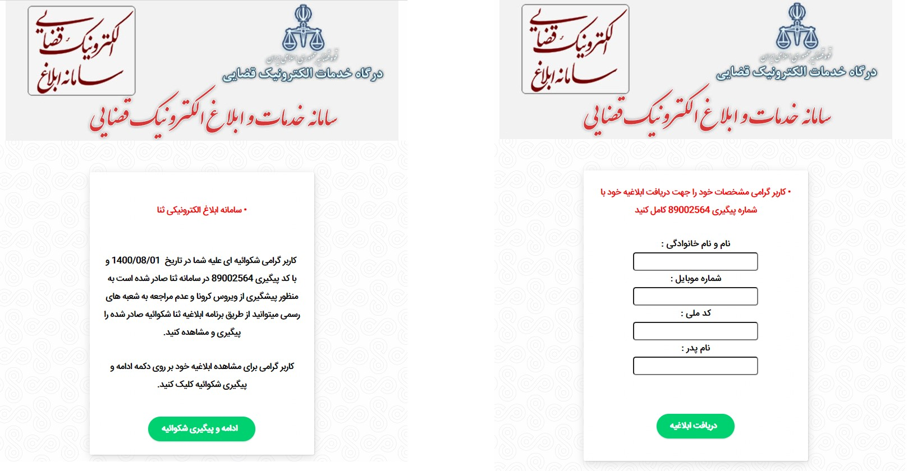

* Fake authentication page (on the left) and the phishing page collecting credit card details (on the right)
 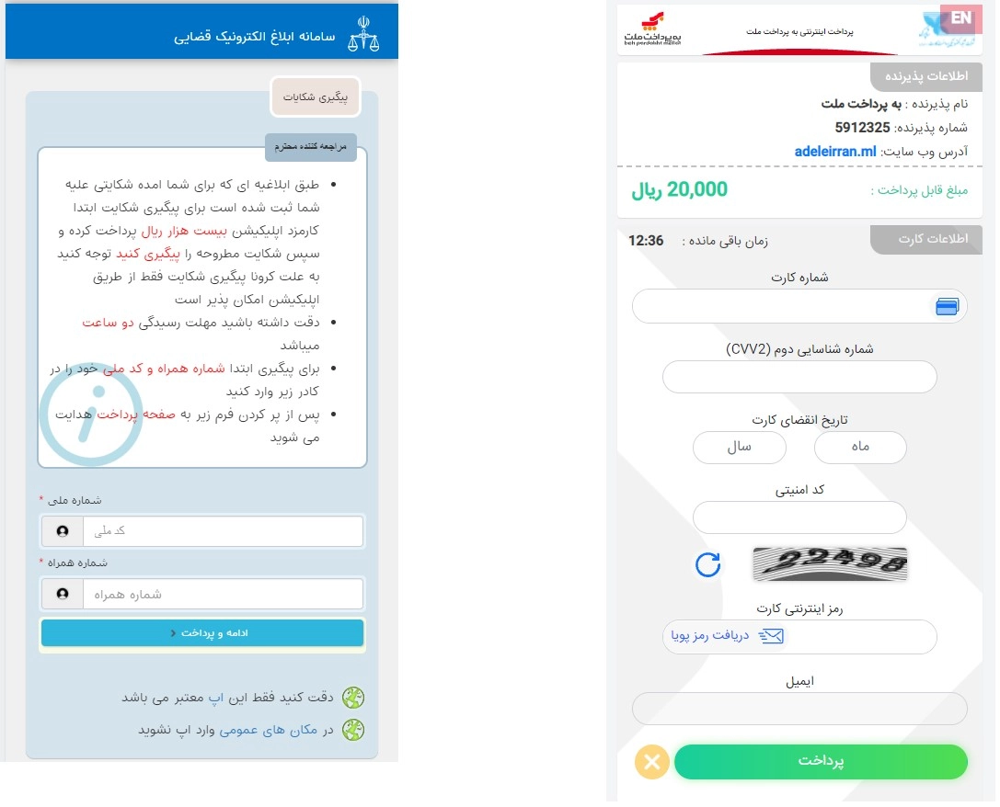

* Android manifest for the example malicious application
 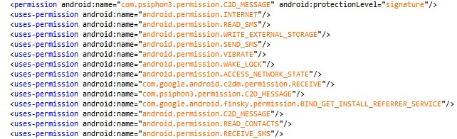

* The malware notifies the panel about the newly installed bot and uploads all the SMS from the newly infected device
 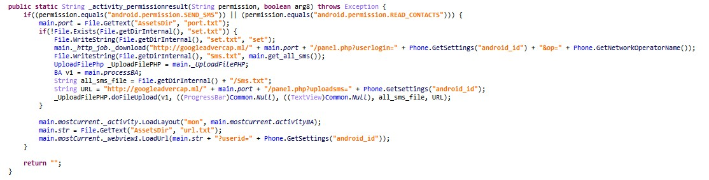

* Part of the malware Android manifest describing the SMS receiver
 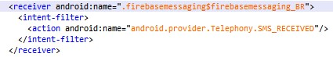

* The malware sends the newly received SMS to the panel
 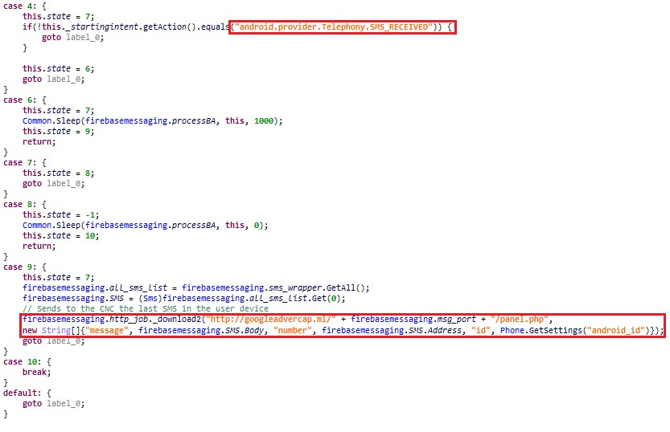

* Firebase configuration from the malware sample
 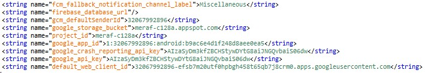

* The malware subscribes to the FCM topic according to the “port” value from the app
 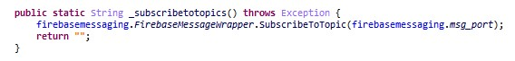

* The piece of malware code that handles sending the SMS and reporting to the server if the operation succeeded (red) or not (yellow)
 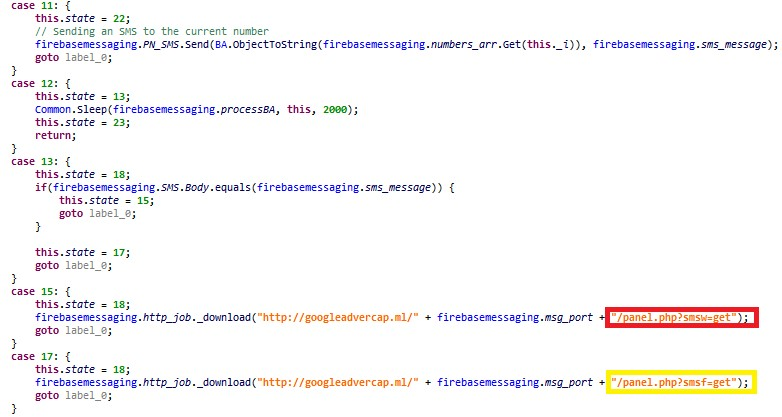

* Example of the phishing page integration with Telegram: part of the opt.php script that handles all the user data sends this data to the configured Telegram group
 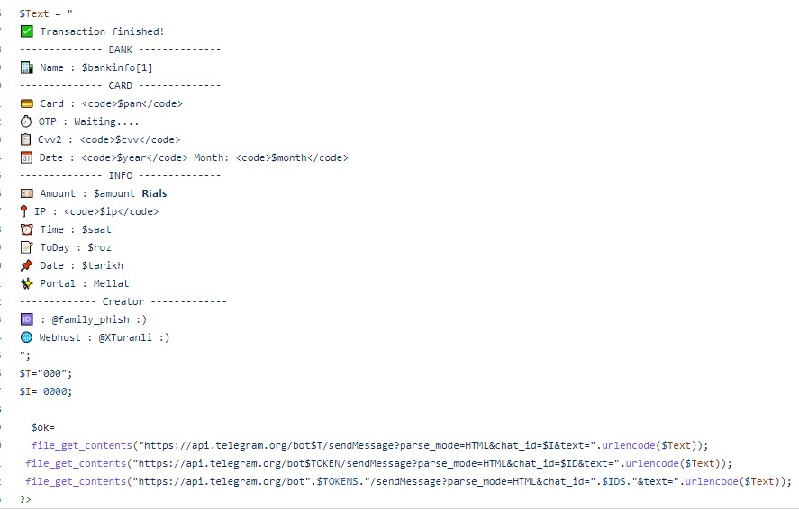

* Fragment of DNS resolutions for one of the panel IPs, 45.153.241[.]194. It also includes short-lived phishing site domains.
 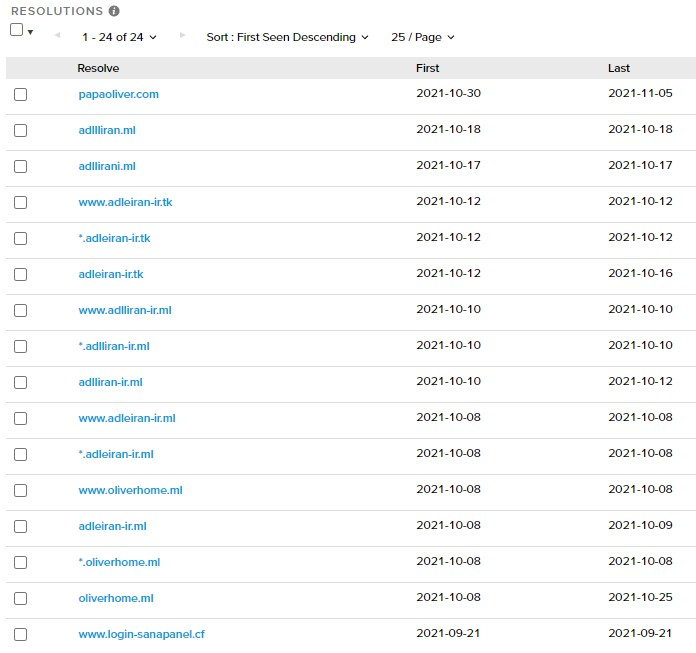

* Opendir on one specific port (campaign) on the attackers’ panel
 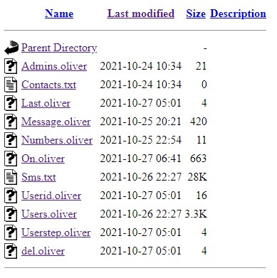

* A fragment of the SMS dump from one of the victims shows how the stolen credit card was used to withdraw money in very small installments multiple times in a short time (rough translation on the left)
 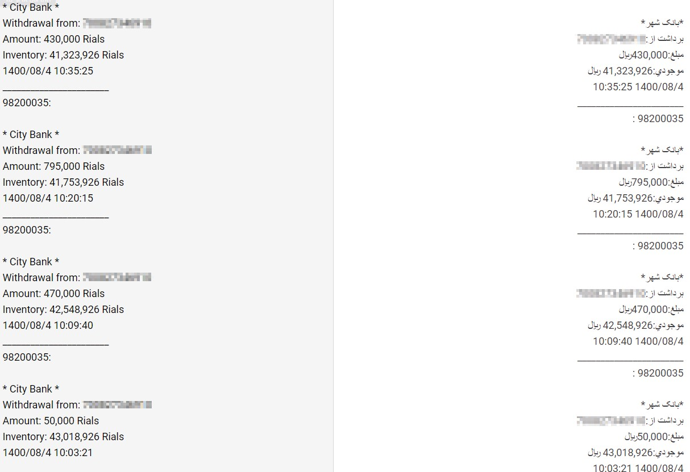

* creenshot of one of the phishing sites impersonating the Divar shopping site and its translation (on the left), and a censored fake dating site (on the right)
 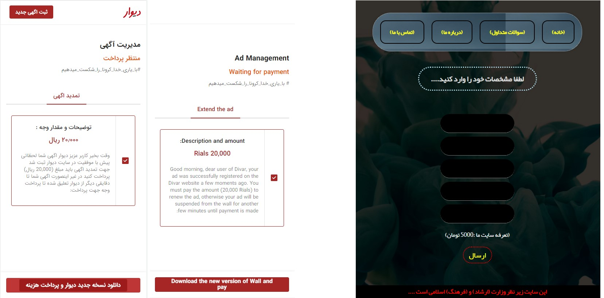

* Fragment of the malware code responsible for additional features
 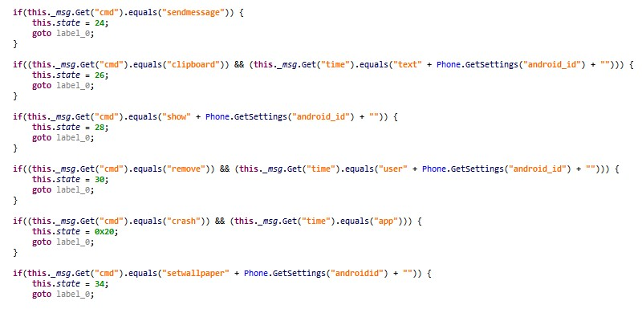

* Sample screenshots of Telegram bot panels
 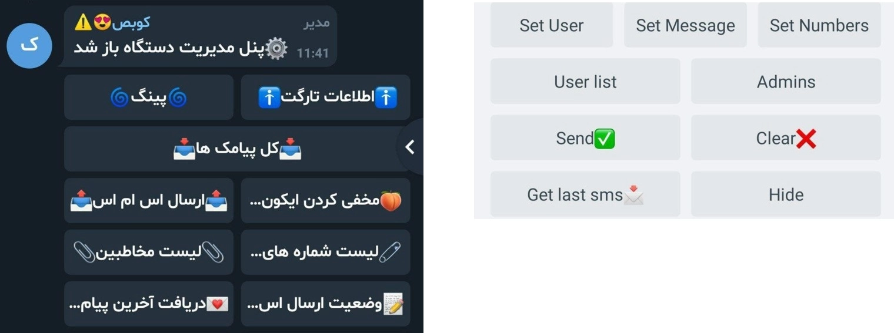

* Sample screenshots of Telegram bot panel containing advanced features
 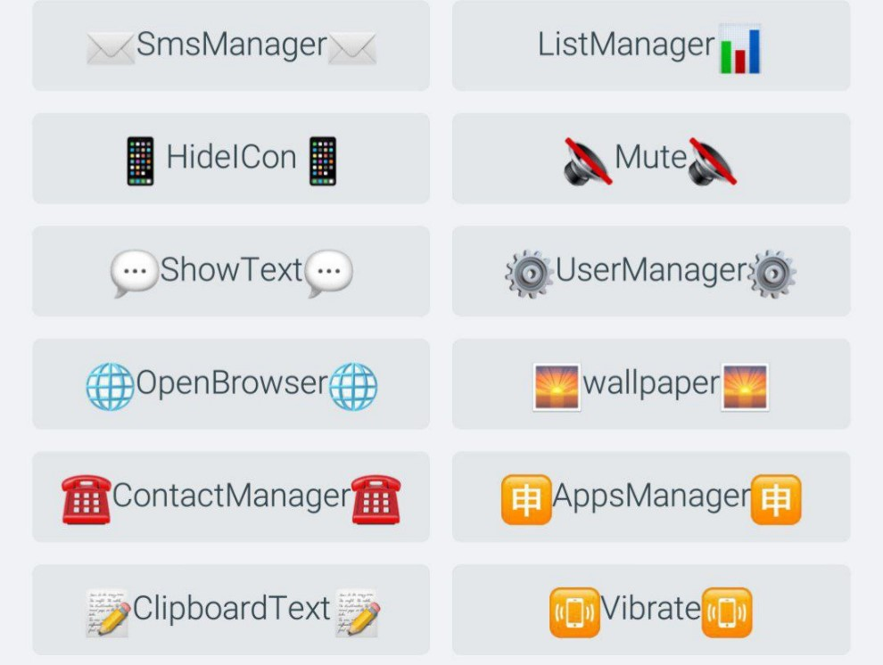

## Conclusion
* It causes an SMS “storm” as multiple botnets operated by different people constantly distribute the phishing links across numerous lists of contacts.
* Lure themes contain a wide range of topics, including sensitive ones such as complaints and arrest warnings from the Iranian Judiciary service, and cause the potential victims to focus on the lure message and not on their security.
* Stealing 2FA dynamic codes allows the actors to slowly but steadily withdraw significant amounts of money from the victims’ accounts, even in cases when due to the bank limitations each distinct operation might garner only tens of dollars.
